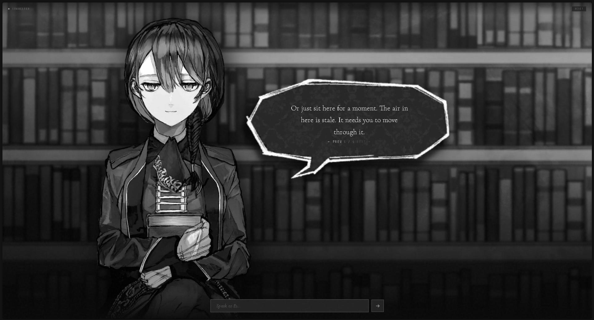

# es-interface

A visual novel–style chat interface for your OpenClaw AI agent. Character portraits, expression system, speech bubbles, chunk navigation — no streaming jank.

Built around a bridge server (Express + Socket.IO) that connects to your local OpenClaw gateway via WebSocket.



---

## What This Is

This is a **front-end shell**. It does not include an AI agent. You bring your own agent configured inside OpenClaw. The interface handles:

- Connecting to your OpenClaw gateway
- Sending/receiving messages via `chat.send`
- Rendering responses as paginated speech bubble chunks
- Switching character expressions based on inline tags in agent replies
- Idle animation loop when no conversation is active

---

## Prerequisites

- [OpenClaw](https://openclaw.dev) installed and running locally
- Node.js 18+
- An agent configured in OpenClaw (see [Agent Setup](#agent-setup))
- Character assets (see [Assets](#assets))

---

## OpenClaw Gateway Configuration

This interface connects to OpenClaw's local gateway. You need to enable the gateway and configure it to accept connections from `localhost:3000`.

In your OpenClaw config (typically `~/.openclaw/openclaw.json`), set:

```yaml
gateway:
  port: 18789 # or whichever your port on Openclaw
  mode: local
  bind: loopback
  controlUi:
    allowedOrigins:
      - "http://localhost:3000"
    allowInsecureAuth: false
    dangerouslyDisableDeviceAuth: true
  auth:
    token: "your-gateway-token-here"
```

> **`dangerouslyDisableDeviceAuth: true`** — Required for this interface to connect without going through OpenClaw's device pairing flow. Only use this on a machine you control. Do not expose the gateway port to the internet.

> **`allowInsecureAuth: false`** — Keep this as-is. The token in your `.env` handles auth.

---

## Installation

```bash
git clone https://github.com/yourname/es-interface
cd openclaw-vn-interface
npm install
```

Copy the example env file:

```bash
cp .env.example .env
```

Edit `.env`:

```env
OPENCLAW_GATEWAY_URL=ws://localhost:4000
OPENCLAW_GATEWAY_TOKEN=your-gateway-token-here
OPENCLAW_AGENT=your-agent-name
PORT=3000
```

- `OPENCLAW_GATEWAY_URL` — WebSocket URL of your OpenClaw gateway
- `OPENCLAW_GATEWAY_TOKEN` — Must match the token in your OpenClaw gateway config
- `OPENCLAW_AGENT` — The name of your agent as defined in OpenClaw
- `PORT` — Port for this interface (default: 3000)

---

## Running

Make sure OpenClaw is running first, then:

```bash
npm start
```

Open `http://localhost:3000` in your browser.

---

## Agent Setup

Your OpenClaw agent needs to be configured and running. The interface connects using the session key `agent:{AGENT_NAME}:hud`.

This repo ships with no agent config. You have two options:

Any OpenClaw agent works. To use the expression system, have your agent include tags in its replies using this format:

```
[expressions/expression-name.png] Your reply text here.
```

The interface will strip the tag, switch the character portrait, and display the remaining text. One tag per message chunk is fine; the first tag found applies to that chunk.

---

## Expression System

Place character images in `public/assets/expressions/`. The interface maps tag keys to filenames via `EXPR_MAP` in `public/index.html`.

Current map (edit to match your assets):

```js
const EXPR_MAP = {
  'bashful_defense_closed_eyes': 'bashful-defense-closed-eyes',
  'bashful_defense_flustered':   'bashful-defense-flustered',
  'bashful_defense_shy':         'bashful-defense-shy',
  'flip_page_book':              'flip-page-book',
  'genuine_smile':               'genuine-smile',
  'manic_smile':                 'manic-smile',
  'melancholic_smile':           'melancholic-smile',
  'normal_with_book':            'normal-with-book',
  'reading_book':                'reading-book',
  'sardonic_smile':              'sardonic-smile',
};
const DEFAULT_EXPR = 'normal-with-book';
```

Rename or extend this map to match whatever expressions your character has.

---

## Assets

No images are included in this repo. You need to supply your own.

```
public/assets/
  bg.jpg                    # Background image
  bubble-chat.png           # Speech bubble graphic
  expressions/
    normal-with-book.png    # Default expression (required)
    ...                     # All other expressions in your EXPR_MAP
```

**Character sprites** — The sprites used in development are Es from [*Alter Ego*](https://www.alterego-game.com/) by Caramel Column. They are not redistributed here for copyright reasons. You can use any character art you own or have rights to.

Expected format for sprites:
- PNG with transparent background
- Portrait orientation, bottom-anchored composition (character stands from the bottom of the frame up)
- Consistent dimensions across all expressions — the interface sizes by container, not per-image

**Speech bubble** — The bubble PNG is mirrored horizontally in CSS (`transform: scaleX(-1)`). Draw or source it with the tail on the right; the flip is handled automatically.

**Background** — Any image works. The interface applies `grayscale(0.2) brightness(0.72)` and a gradient overlay on top of it.

---

## Touch / Click Interactions

Clicking or tapping the character sprite sends an action message to the agent:

| Gesture | Zone | Message sent |
|---|---|---|
| Quick tap (nose area) | Center face | `**boops nose**` |
| Quick tap (cheek) | Lower face | `**taps cheek**` |
| Quick tap (other head) | Head | `**pokes head**` |
| Hold (800ms) | Head | `**pats head**` |
| Drag | Head | `**strokes hair**` |
| Double tap | Head | `**taps head twice**` |

Your agent can respond to these however its personality dictates.

---

## API Endpoints

The server exposes a few REST endpoints if you want to drive it externally:

| Method | Path | Description |
|---|---|---|
| `POST` | `/api/message` | Send a message as if typed by the user |
| `POST` | `/api/session/reset` | Clear history and reset session |
| `GET` | `/api/history` | Paginated message history |
| `GET` | `/api/gateway/status` | Gateway connection status |

---

## Project Structure

```
├── server.js           # Express + Socket.IO bridge server
├── public/
│   ├── index.html      # Frontend (all JS inline)
│   └── assets/         # Your images go here (not included)
├── .env.example
├── .gitignore
└── package.json
```

---

## License

MIT
